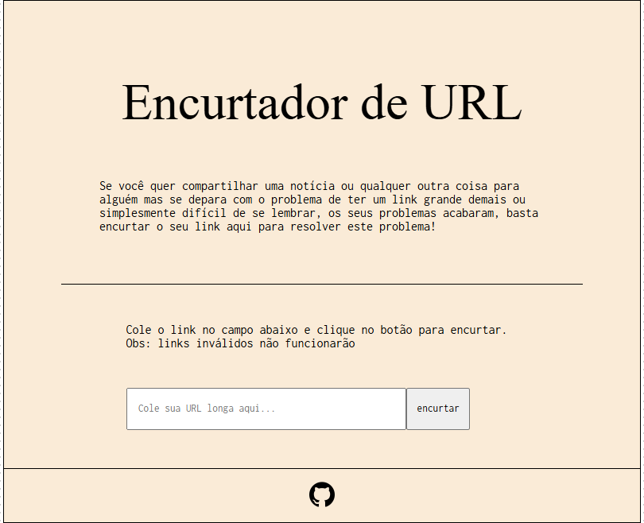

# ⭐ENCURTADOR_DE_URL
    O ENCURTADOR_DE_URL tem a função de pegar uma URL longa e criar uma URL pequena que 
    nos redirenciona para o seu caminho original. 

## ⚒️ Tecnologias utilizadas
- Javascript
- Express.js
- Node.js
- MongoDB
- Mongoose
- Git

## 🕹️ Funcionalidades principais
- Capturar o link da caixa de entrada e retornar um link curto

## 🛰️ Deploy
[ visitar ](https://json-conversor.vercel.app/)

##  📜 melhorias futuras 
- links ainda mais curtos

## 📄 Licença
MIT © Dayvson
